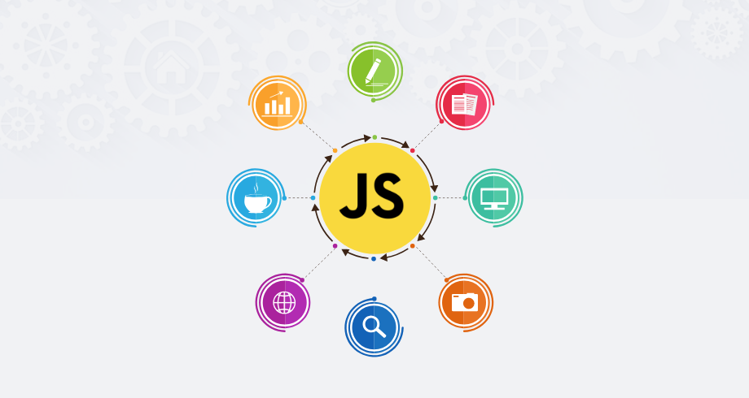

<!-- ************************************* logo ********************************************* -->

 

 

# Curso : Orientação a Objetos com JavaScript ( Projetos e TypeScript )

<!-- ************************************* Baadges ********************************************* -->

  
  
  

Curso Iniciado em : 01/08/2024 - 00/00/0000

## 🚀 Sobre o Curso

### *Seção 1 - Introdução*

_**1 - O que é Orientação a Objetos ?**_ 
- Um paradigma de programação baseado em objetos;
- Onde os objetos interagem entre si;

_**2 - E o objeto é uma instância de uma classe;**_
- Auxilia no reaproveitamento de código;
- Torna o código menos confuso em relação ao procedural;
- Design Patterns; ( Padrões de Código )

_**3 - OO x mundo Real**_
- Uma **classe** Carro **representa todos os carros do mundo**;
- Porém **cada carro se distingue do outro**, sendo assim eles **são objetos**;
- Tendo **características** ( **propriedades** ) e funcionalidades próprias ( **métodos** );
- O Carro pode ter 4 ou 2 portas ( **propriedades** );
- Podemos acelerar ou frear com o Carro( **Métodos** );

_**4 - OO e JavaScript**_
- JavaScript **não** é uma linguagem baseada em classes;
- Porém podemos utilizar a OOP nela;
- Na versão ES2015 foi inserida a funcionalidade de Classe no JS;
- **JS possui Prototypes**, isso faz com que **todos os objetos tenham um pai**;
- Além dos seus objetos built-in como : Number, Boolean, Array, Object, Error e tc...

_**5 - Fazendo download do VSCode( editor de texto utilizado no curso )**_

_**6 - Como executar JS no navegador por arquivo**_
- Foi desenvolvido um exemplo, que a partir de um arquivo index.html e um arquivo script.js instanciado 
no arquivo html faz a impressão via console do navegador Chrome a mensagem "Testando o JavaScript". 

_**7 - Como executar o JS diretamente no navegador**_

_**8 - Outra forma de programar em JavaScript**_

_**9 - Como pesquisar problemas/ dúvidas de código no Stackoverflow**_

**[12 - Arquivos do Curso](documents/js_oop_curso-master.zip)**

**[13 - Slides do Curso](documents/10-JSOOP.pdf)**

**14 - Conclusão da Seção**
 - Apenas um comentário do que foi explicado na seção 1 sem mais explicações;

### Seção 2 - Objetos

## 🧰 Ferramentas

* [Google Chrome]() - Browser utilizado.
* [Visual Studio Code]() - IDE de desenvolvimento.
*  - 

## ⚙️ Tencologias 

* HTML 
* Orientação a Objetos
* JavaScript
* TypeScript
* 

## 📚 Referências

* [Matheus Battisti](https://www.linkedin.com/in/matheusbattisti/) - Instrutor

[Orientação a Objetos com JavaScript (Projetos e TypeScript)](https://www.udemy.com/course/orientacao-a-objetos-com-javascript-projetos-e-typescript/) - Curso do Udemy
